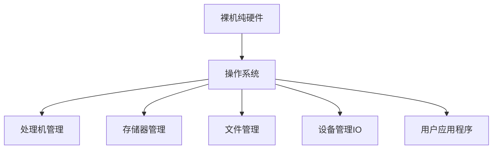
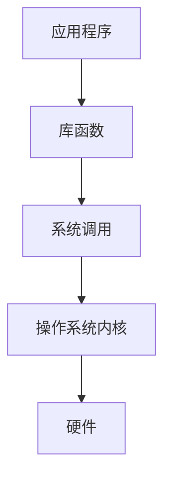
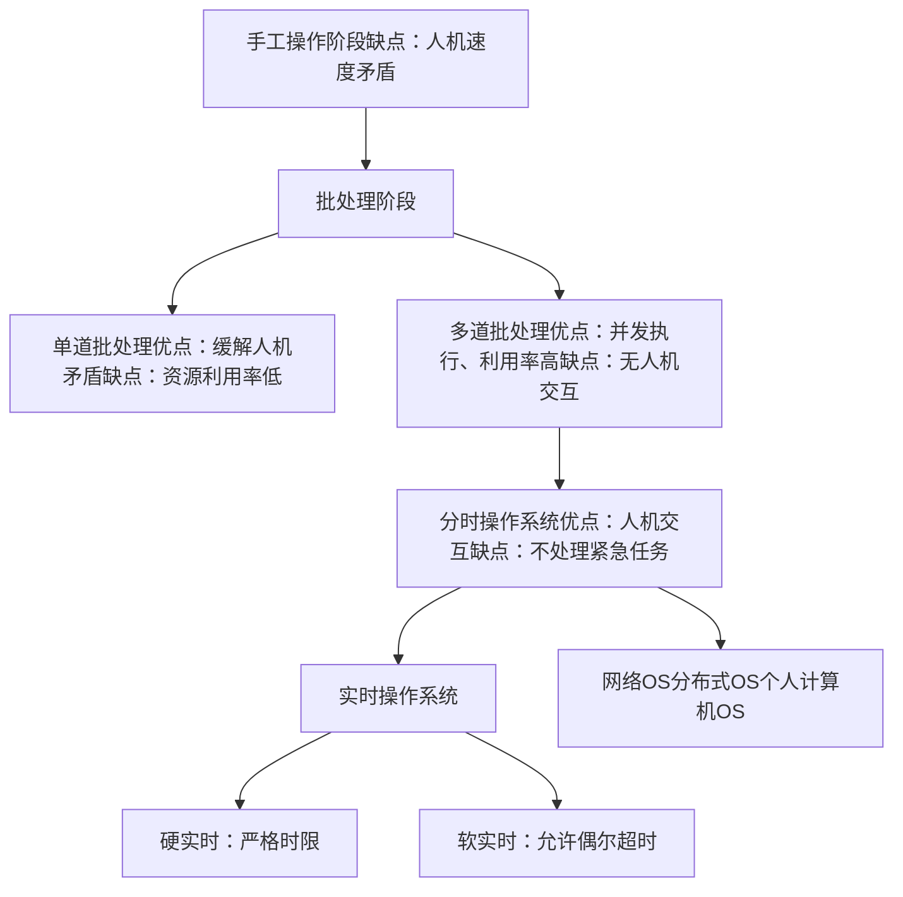
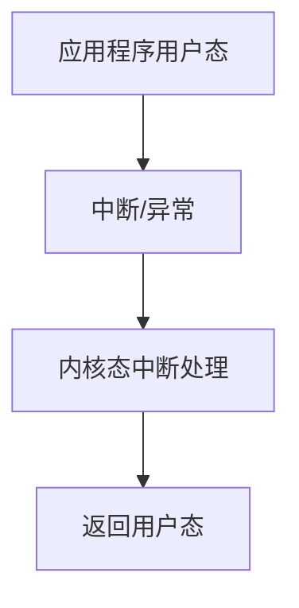
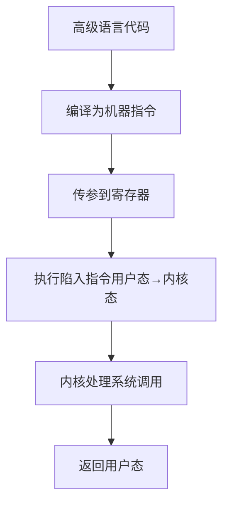
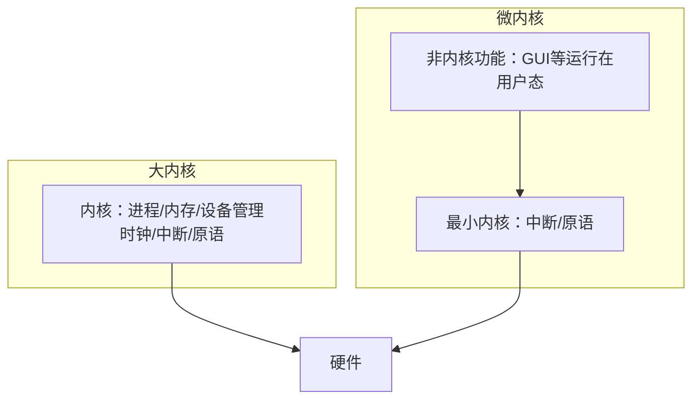
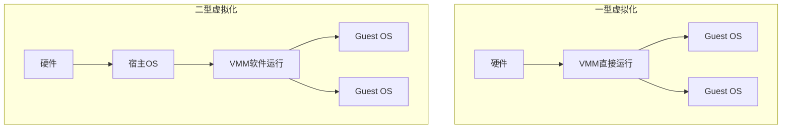
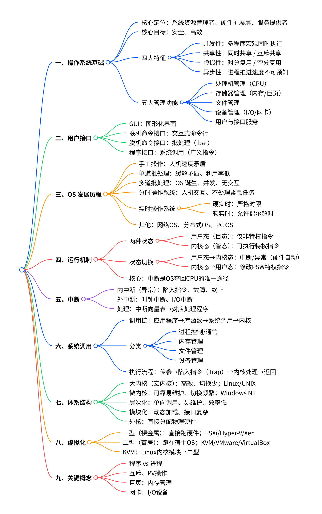

# 操作系统学习笔记

> ✨ 思考是行动的种子。— 爱默生

## 个人学习感悟

理解了**进程**和**程序**的区别、什么是**中断**、**PV操作**、**互斥**等概念；工作中遇到的**巨页**属于内存管理范畴，**网卡**属于 I/O 设备管理范畴；掌握了**虚拟化类型**的核心区别。

---

# 一、操作系统基础

## 1.1 核心定位

系统资源管理者、硬件扩展层、服务提供者

## 1.2 核心目标

安全、高效

## 1.3 四大特征

- 并发性：多程序宏观同时执行

- 共享性：同时共享 / 互斥共享

- 虚拟性：时分复用 / 空分复用

- 异步性：进程推进速度不可预知

## 1.4 五大管理功能

- 处理机管理（CPU）

- 存储器管理（内存/巨页）

- 文件管理

- 设备管理（I/O/网卡）

- 用户与接口服务

### 五大管理功能关联图

### 运行QQ并视频聊天的过程（示例）

1. 逐层打开文件夹，找到 QQ.exe 存放路径（如 `D:/Tencent/QQ/Bin`）

2. 双击打开 QQ.exe

3. QQ 程序正常运行

4. 与朋友视频聊天

---

# 二、用户接口

- GUI：图形化界面

- 联机命令接口：交互式命令行

- 脱机命令接口：批处理（.bat）

- 程序接口：系统调用（广义指令）

### 用户接口调用流程

---

# 三、OS 发展历程

- 手工操作：人机速度矛盾

- 单道批处理：缓解矛盾、利用率低

- 多道批处理：OS 诞生、并发、无交互

- 分时操作系统：人机交互、不处理紧急任务

- 实时操作系统
        

    - 硬实时：严格时限

    - 软实时：允许偶尔超时

- 其他：网络OS、分布式OS、PC OS

### OS发展历程流程图

---

# 四、运行机制

## 4.1 两种状态

- 用户态（目态）：仅非特权指令

- 内核态（管态）：可执行特权指令

## 4.2 状态切换

- 用户态→内核态：中断/异常（硬件自动）

- 内核态→用户态：修改PSW特权指令

## 4.3 核心要点

中断是OS夺回CPU的唯一途径

### 状态切换流程图

---

# 五、中断

- 内中断（异常）：陷入指令、故障、终止

- 外中断：时钟中断、I/O中断

- 处理方式：中断向量表→对应处理程序

---

# 六、系统调用

## 6.1 调用链

应用程序→库函数→系统调用→内核

## 6.2 分类

- 进程控制/通信

- 内存管理

- 文件管理

- 设备管理

## 6.3 执行流程

传参→陷入指令（Trap）→内核处理→返回

### 系统调用执行流程图

---

# 七、体系结构

- 大内核（宏内核）：高效、切换少；代表系统Linux、UNIX

- 微内核：可靠易维护、切换频繁；代表系统Windows NT

- 层次化：单向调用、易维护、效率低

- 模块化：动态加载、接口复杂

- 外核：直接分配物理硬件

### 大内核与微内核对比表

|对比项|大内核|微内核|
|---|---|---|
|CPU 状态切换|少，效率高|频繁，开销大|
|维护难度|复杂|简单、灵活|
|维护难度|复杂|简单、灵活|
|典型系统|Linux、UNIX|Windows NT|
### 体系结构示意图

---

# 八、虚拟化

- 一型（裸金属）：直接运行在硬件上；代表ESXi、Hyper‑V、Xen

- 二型（寄居）：运行在宿主OS之上；代表KVM、VMware、VirtualBox

- KVM：依赖Linux内核模块，属于二型虚拟化

### 虚拟化类型示意图

### 一型与二型虚拟化对比表

|维度|一型 VMM|二型 VMM|
|---|---|---|
|资源控制|直接控制硬件|依赖宿主 OS|
|性能|更好|较差|
|迁移性|好|较差|
|特权级|Ring0|用户态+内核态混合|
---

# 九、关键概念

- 程序 vs 进程

- 互斥、PV操作

- 巨页：属于内存管理范畴

- 网卡：属于I/O设备管理范畴

---

## 补充：操作系统引导（Boot）

开机后硬件初始化 → 加载引导程序 → 启动操作系统内核
#

