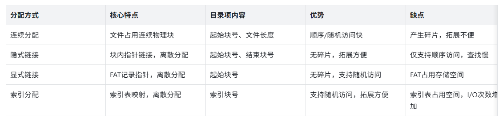
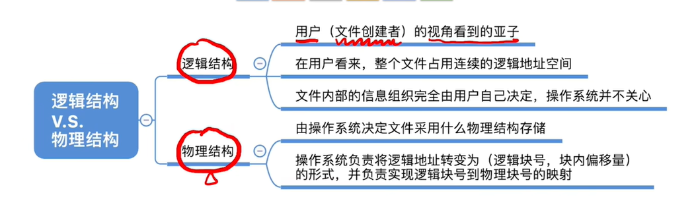
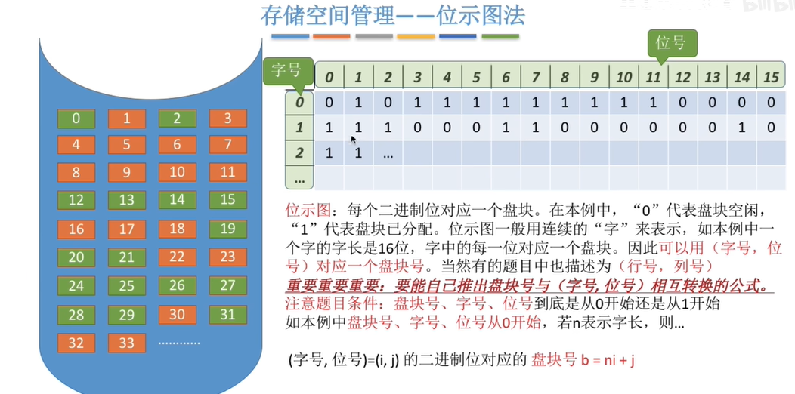
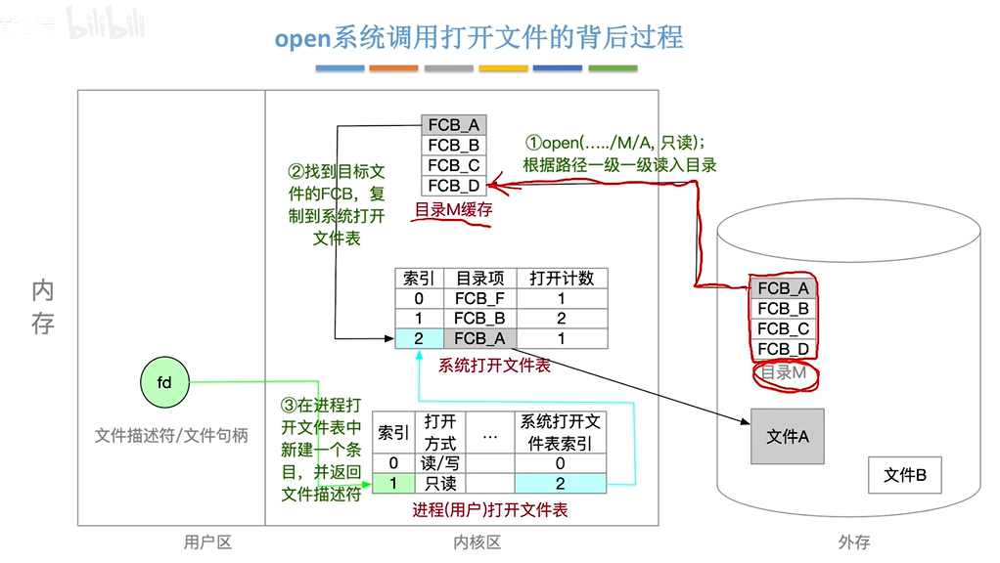
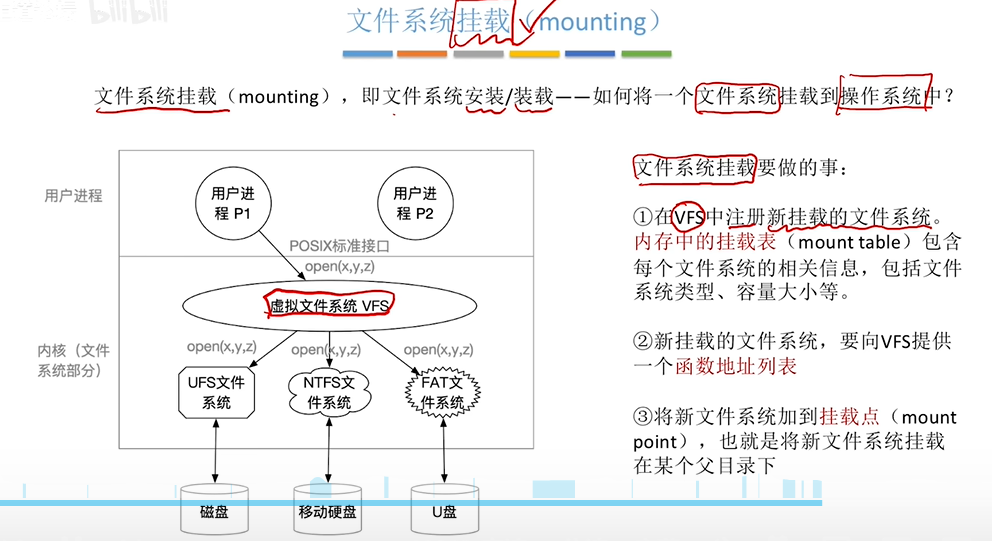

操作系统-第4章文件管理（GitHub部署版）

本文档整理自操作系统第4章文件管理相关内容，按GitHub Markdown格式优化，清晰梳理核心知识点、逻辑框架及考点，方便部署与查阅。

一、文件的逻辑结构

1.1 文件分类（按是否有结构）

- 无结构文件：又称“流式文件”，由一系列二进制流或字符流组成，如Windows系统中的.txt文件。

- 有结构文件：又称“记录式文件”，由一组相似的记录组成，每条记录包含若干数据项（如数据库表文件）。
        

  - 按记录长度分类：定长记录、可变长记录。

  - 每条记录通常有一个数据项作为关键字。

1.2 有结构文件的逻辑组织方式

1.2.1 顺序文件

文件中的记录一个接一个顺序排列（逻辑上），记录可分为定长或可变长，物理上可采用顺序存储或链式存储。

- 物理存储方式：
        

  - 顺序存储：逻辑上相邻的记录，物理上也相邻（类似顺序表）。

  - 链式存储：逻辑上相邻的记录，物理上不一定相邻（类似链表）。

- 记录顺序分类：
        

  - 串结构：记录顺序与关键字无关，按存入时间排序。

  - 顺序结构：记录按关键字顺序排列。

- 核心结论：
        

  - 可变长记录（无论顺序/链式存储）：无法实现随机存取，只能从头依次查找。

  - 定长记录+顺序存储：可实现随机存取；若为顺序结构，可通过折半查找实现快速检索。

  - 最大缺点：不方便增加/删除记录。

1.2.2 索引文件

解决可变长记录无法快速查找的问题，为每个文件建立一张索引表，索引表本身是定长记录的顺序文件。

- 索引表特点：每条记录对应一个索引项，包含记录长度、物理地址指针。

- 优势：
        

  - 支持随机存取，可按关键字折半查找（若索引表按关键字排序）。

  - 方便增加/删除记录，只需修改索引表。

  - 可建立多个索引表（如按学号、姓名分别建立），提升检索灵活性（如SQL的索引功能）。

- 适用场景：对信息处理及时性要求较高的场景。

1.2.3 索引顺序文件

结合顺序文件和索引文件的优势，为顺序文件建立多级索引表，进一步提高检索效率。

- 多级索引逻辑：
        

  - 低级索引表：将原文件记录分组，每组对应一个索引项。

  - 顶级索引表：将低级索引表的记录分组，每组对应一个索引项。

- 示例：10⁶条记录的文件，每100条为一组建立低级索引（10⁴个索引项），再将10⁴个索引项每100个为一组建立顶级索引（100个索引项），检索效率大幅提升。

- 核心特点：检索时先查索引表找到分组，再在分组内顺序查找，需掌握平均查找次数计算。

1.3 知识点回顾与重要考点

- 顺序文件：可变长记录无法随机存取；定长+顺序结构可快速检索，缺点是增删不便。

- 索引文件：解决增删和可变长记录检索问题，支持随机存取，缺点是索引表占用存储空间。

- 索引顺序文件：多级索引提升检索效率，需掌握分组逻辑和平均查找次数计算。

二、文件目录

2.1 文件目录的本质

目录本身是一种有结构文件，由一条条目录项（记录）组成，每条目录项对应一个文件/目录，包含文件名、类型、存取权限、物理位置等信息。

例：双击“照片”目录时，操作系统查找该目录的目录项，读取其物理位置，将目录信息调入内存并显示。

2.2 目录结构

2.2.1 单级目录结构

- 整个系统只有一张目录表，每个文件占一个目录项。

- 优势：实现“按名存取”，结构简单。

- 缺点：不允许文件重名，不适用于多用户操作系统。

2.2.2 多级目录结构（树形目录结构）

- 结构：根目录→子目录→文件，形成树形结构（如Windows、Linux的目录结构）。

- 核心优势：不同目录下的文件可以重名，解决单级目录的重名问题。

- 路径概念：
        

  - 相对路径：从当前目录出发的路径（如Linux中“./2015-08/自拍.jpg”）。

  - 当前目录：已调入内存的目录，可减少磁盘I/O，提升访问速度。

2.2.3 无环图目录结构

- 基于树形目录结构，增加指向同一节点的有向边，形成有向无环图。

- 核心优势：方便多用户文件共享，可通过不同文件名指向同一个文件/目录。

2.3 索引结点（FCB的改进）

目的：优化目录检索效率，让目录表“瘦身”——检索目录时仅需用到文件名，将其他文件信息（类型、权限、物理位置等）存入索引结点。

- 目录项组成：仅包含文件名 + 索引结点指针。

- 效率提升示例：
        

  - 假设FCB为64B，磁盘块1KB，每个磁盘块仅能存16个FCB；640个目录项需40个磁盘块，平均检索需20次磁盘I/O。

  - 使用索引结点后，文件名14B+指针2B，每个磁盘块可存64个目录项，平均检索仅需5次磁盘I/O。

2.4 存储空间的划分与初始化

2.4.1 划分

将物理磁盘划分为一个个文件卷（逻辑卷/逻辑盘，如C盘、D盘），部分系统支持多个物理磁盘组成一个文件卷。

2.4.2 初始化

每个文件卷划分为两个区域：

- 目录区：存放文件目录信息（FCB）、磁盘存储空间管理信息（空闲表、位示图等）。

- 文件区：存放文件数据。

三、文件的物理结构

3.1 基础概念

- 磁盘块：外存被划分为大小相等的块（如1KB），每个块包含2的整数幂个地址。

- 文件块：文件的逻辑地址空间被划分为与磁盘块大小一致的块，逻辑地址表示为（逻辑块号，块内地址）。

- 地址映射：操作系统需将逻辑块号转换为物理块号，块内地址保持不变。

3.2 文件分配方式

3.2.1 连续分配

- 定义：每个文件在磁盘上占有一组连续的物理块。

- 地址映射：物理块号 = 起始块号 + 逻辑块号（需检查逻辑块号合法性）。

- 优势：支持顺序访问和随机访问，存取速度快。

- 缺点：存储空间利用率低，会产生磁盘碎片；文件拓展不便，需进行紧凑操作（耗费时间）。

3.2.2 链式分配

离散分配方式，文件的物理块离散存放，通过指针链接，分为隐式链接和显式链接。

- 隐式链接：
       

  - 特点：除最后一个磁盘块外，每个块都存有指向下一个块的指针；目录记录文件的起始块号和结束块号。

  - 优势：无碎片，外存利用率高，文件拓展方便。

  - 缺点：仅支持顺序访问，不支持随机访问；指针占用少量存储空间，查找效率低。

- 显式链接（FAT方式）：
        

  - 特点：将链接指针显式存放在文件分配表（FAT）中，一个磁盘仅一张FAT，开机后常驻内存。

  - 目录记录：仅需记录文件的起始块号。

  - 优势：继承隐式链接的优点，同时支持随机访问（查询内存中的FAT），访问效率更高。

  - 缺点：FAT占用一定的存储空间。

注：考试中未指明“隐式/显式”的链式分配，默认指隐式链接。

3.2.3 索引分配

离散分配方式，为每个文件建立一张索引表（类似内存管理的页表），索引表记录逻辑块号与物理块号的映射关系，索引表存放于索引块，文件数据存放于数据块。

- 目录记录：文件的索引块号。

- 优势：支持随机访问，文件拓展方便，无碎片问题。

- 缺点：索引表占用存储空间；访问数据块需先读入索引块，增加磁盘I/O。

- 大文件索引解决方案：
        

  - ① 链接方案：多个索引块链接存放，缺点是查找索引块需多次磁盘I/O，效率低。

  - ② 多层索引：建立多级索引（类似多级页表），如两层索引可支持最大64MB文件（1KB磁盘块+4B索引项），访问数据块需K+1次磁盘I/O（K为索引层数）。

  - ③ 混合索引：结合直接地址索引、一级间接索引、两级间接索引，小文件可减少磁盘I/O次数。

3.3 三种分配方式对比

3.4 文件逻辑结构与物理结构对比

文件的逻辑结构与物理结构是文件管理的两大核心，二者相互独立又紧密关联——逻辑结构面向用户，解决“数据怎么用”的问题；物理结构面向系统，解决“数据怎么存”的问题，具体对比如下：

示例：一个.txt文本文件（逻辑结构为流式文件，用户按字节/字符访问），物理上可采用连续分配（存取快）或链式分配（无碎片），无论物理块位置如何变化，用户看到的文本内容（逻辑结构）始终不变。

四、文件存储空间管理

4.1 空闲表法

- 适用场景：连续分配方式。

- 空闲表组成：记录每个连续空闲区的“第一个空闲盘块号”和“空闲盘块数”。

- 分配：类似内存动态分区分配，采用首次适应、最佳适应、最坏适应等算法。

- 回收：需考虑四种情况（前后无空闲区、前后都有、仅前面有、仅后面有），注意空闲区合并。

4.2 空闲链表法

将空闲盘块/盘区以链表形式管理，分为两种类型：

- 空闲盘块链：以盘块为单位组成链表，分配时从链头取块，回收时将块插入链尾。

- 空闲盘区链：以连续的空闲盘区为单位组成链表，每个盘区记录自身长度和下一个盘区指针。
        

  - 分配：采用首次适应、最佳适应等算法，查找符合大小的空闲盘区。

  - 回收：注意相邻空闲盘区的合并，修改链表指针。

4.3 位示图法

- 核心逻辑：每个二进制位对应一个磁盘块，“0”表示空闲，“1”表示已分配（具体需看题目要求）。

- 位示图存储：用连续的“字”表示，字长决定每个字对应的盘块数（如16位字长对应16个盘块）。

- 核心考点：盘块号与（字号，位号）的相互转换（需注意编号从0还是1开始）。

        

  - 公式（编号从0开始，字长为n）：盘块号b = 字号×n + 位号。

4.4 成组链接法

UNIX系统采用的策略，适合大型文件系统，核心是将空闲盘块分组链接，理解其基本逻辑即可（考题中较少涉及细节）。

4.5 知识点回顾与重要考点

- 基础概念：文件卷、目录区、文件区的划分与作用。

- 空闲表法：分配/回收算法，空闲区合并。

- 空闲链表法：两种链表的区别与管理逻辑。

- 位示图法：核心是盘块号与（字号，位号）的转换，注意题目中的编号规则。

五、文件的基本操作

5.1 核心系统调用

操作系统向上提供的基本文件操作，需先打开文件，再进行读写，最后关闭文件：

- create：创建文件（分配外存空间，创建目录项）。

- delete：删除文件（回收外存空间，删除目录项）。

- open：打开文件（将目录项复制到内存打开文件表，返回索引号/文件描述符）。

- close：关闭文件（删除进程打开文件表项，系统打开文件表计数器减1，计数器为0则删除系统表项）。

- read：读文件（从外存读数据到内存，需指定索引号、数据量、内存位置）。

- write：写文件（从内存写数据到外存，需指定索引号、数据量、内存位置）。

5.2 打开文件的详细过程

5.2.1 open系统调用参数

- 文件路径（如“D:/Demo”）。

- 文件名（如“test.txt”）。

- 操作类型（如只读r、读写rw）。

5.2.2 操作系统处理逻辑

1. 根据文件路径查找目录，找到对应目录项，检查用户操作权限。

2. 将目录项复制到内存中的“系统打开文件表”（整个系统一张）。

3. 在进程的“打开文件表”（每个进程一张）中新建表项，关联系统打开文件表，返回索引号（文件描述符）。

5.2.3 打开文件表的核心属性

- 系统打开文件表：包含文件名、外存地址、打开计数器（记录多少进程打开该文件）等。

- 进程打开文件表：包含读写指针、访问权限、系统打开文件表索引等。

5.3 文件共享（基于索引结点的硬链接）

- 核心逻辑：索引结点中设置链接计数器count，记录链接到该索引结点的目录项数。

- 共享机制：多个用户目录项可指向同一个索引结点（count对应目录项数）。

- 删除逻辑：删除文件时，仅删除对应目录项，count减1；若count=0，才真正删除文件数据和索引结点。

六、文件系统的层次与虚拟文件系统

6.1 文件系统的层次结构（从上层到下层）

1. 用户接口：处理用户的系统调用请求（Read、Write、Open等），提供简单易用的接口。

2. 文件目录系统：根据文件路径查找FCB或索引结点，管理目录、打开文件表等。

3. 存取控制模块：验证用户访问权限，实现文件保护。

4. 逻辑文件系统与文件信息缓冲区：将用户指定的记录号转换为逻辑地址。

5. 物理文件系统：将逻辑地址转换为物理地址。

6. 辅助分配模块：负责文件存储空间的分配与回收。

7. 设备管理模块：与硬件交互，负责设备分配、磁盘调度、设备I/O等。

6.2 虚拟文件系统（VFS）

- 核心作用：为上层用户提供统一的POSIX标准接口，屏蔽下层不同文件系统（如UFS、NTFS、FAT）的差异。

- 核心要求：下层文件系统需实现VFS规定的函数功能，才能在操作系统中使用。

6.3 文件系统挂载（mounting）

将新的文件系统接入操作系统的过程，核心步骤：

1. 在VFS中注册新挂载的文件系统，更新内存中的挂载表（记录文件系统类型、容量等）。

2. 新文件系统向VFS提供函数地址列表，供VFS调用。

3. 将新文件系统挂载到指定挂载点（父目录），实现统一访问。
   

